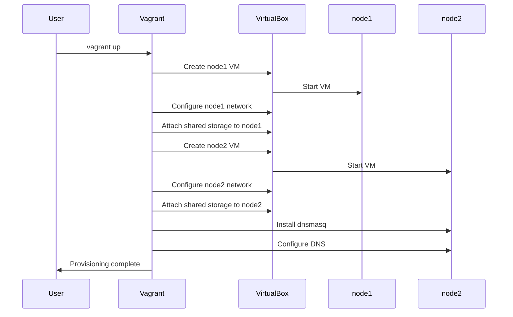
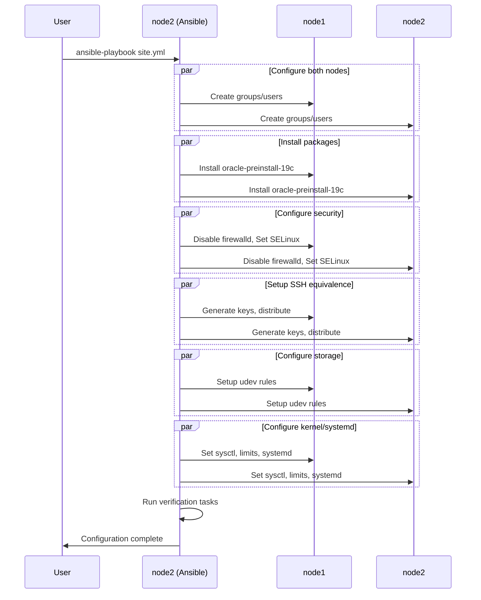
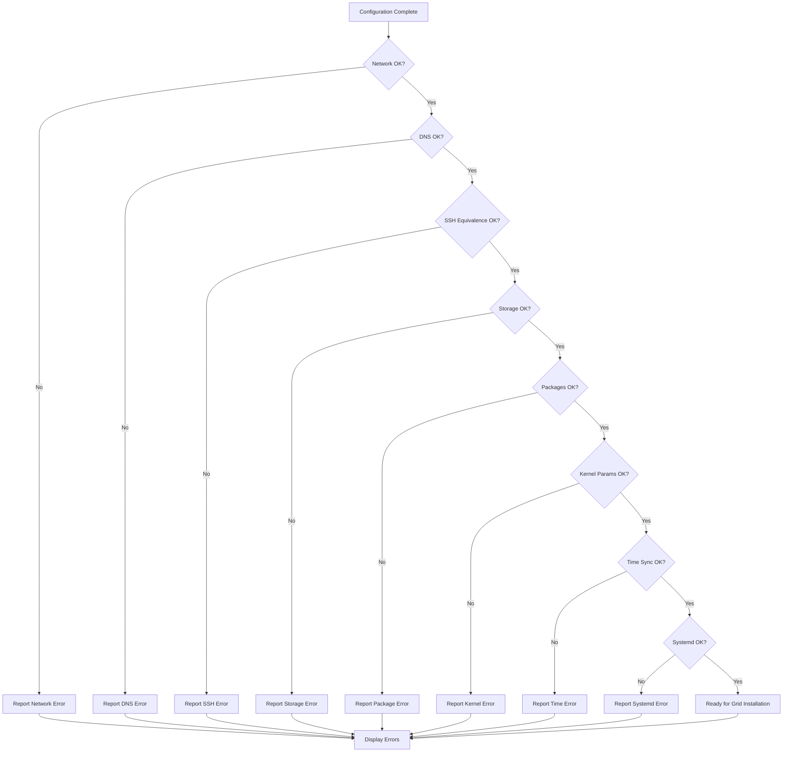

# 설계 문서

## 개요

본 설계 문서는 로컬 개발 환경에서 Oracle 19c RAC(Real Application Clusters) 2노드 클러스터를 자동으로 배포하는 시스템의 기술적 설계를 명세합니다. 이 시스템은 Infrastructure as Code(IaC) 원칙을 따르며, Vagrant와 Ansible을 사용하여 완전 자동화된 배포를 제공합니다.

### 설계 목표

1. **완전 자동화**: 수동 개입 없이 RAC 클러스터 환경 구성
2. **멱등성 보장**: 반복 실행 시 동일한 결과 생성
3. **휴먼 에러 제거**: 코드 기반 구성으로 일관성 보장
4. **재현 가능성**: 버전 관리 가능한 선언적 구성
5. **Rocky Linux 9 호환성**: Oracle 19.19+ RU 사용

### 배포 아키텍처

시스템은 2단계 배포 프로세스를 따릅니다:

**Phase 1 - Vagrant 프로비저닝**:
- VirtualBox를 통한 VM 생성
- 네트워크 인터페이스 구성
- 공유 스토리지 연결
- DNS 서버 설정

**Phase 2 - Ansible 구성**:
- node2를 Ansible control node로 사용
- node1과 node2를 동시에 구성
- OS 레벨 설정 자동화
- 검증 및 준비 상태 확인

## 아키텍처

### 시스템 계층 구조

```
┌─────────────────────────────────────────────────────────────┐
│                    Vagrant Layer (Host)                      │
│  - VM Provisioning                                           │
│  - Network Configuration                                     │
│  - Storage Attachment                                        │
└─────────────────────────────────────────────────────────────┘
                            │
                            ▼
┌─────────────────────────────────────────────────────────────┐
│                  VirtualBox Hypervisor                       │
│  ┌──────────────────────┐    ┌──────────────────────┐      │
│  │      node1 VM        │    │      node2 VM        │      │
│  │  Rocky Linux 9       │    │  Rocky Linux 9       │      │
│  │  8GB RAM, 2 CPU      │    │  8GB RAM, 2 CPU      │      │
│  │  192.168.1.101       │    │  192.168.1.102       │      │
│  │  10.0.0.101          │    │  10.0.0.102          │      │
│  └──────────────────────┘    └──────────────────────┘      │
│           │                            │                     │
│           └────────────┬───────────────┘                     │
│                        │                                     │
│              ┌─────────▼─────────┐                          │
│              │  Shared Storage   │                          │
│              │  - asm_disk1 20GB │                          │
│              │  - asm_disk2 20GB │                          │
│              │  - asm_disk3 10GB │                          │
│              └───────────────────┘                          │
└─────────────────────────────────────────────────────────────┘
                            │
                            ▼
┌─────────────────────────────────────────────────────────────┐
│              Ansible Layer (node2 as control)                │
│  - User/Group Configuration                                  │
│  - Package Installation                                      │
│  - Security Configuration                                    │
│  - Storage Management                                        │
│  - Kernel Parameters                                         │
│  - Systemd Configuration                                     │
└─────────────────────────────────────────────────────────────┘
```

### 네트워크 토폴로지

```
Public Network (192.168.1.0/24) - private_network type
├── node1: 192.168.1.101
├── node2: 192.168.1.102
├── node1-vip: 192.168.1.111
├── node2-vip: 192.168.1.112
└── rac-scan: 192.168.1.121, 192.168.1.122, 192.168.1.123

Private Network (10.0.0.0/24) - virtualbox__intnet
├── node1-priv: 10.0.0.101
└── node2-priv: 10.0.0.102
```

### 컴포넌트 다이어그램

```mermaid
graph TB
    subgraph "Host System"
        Vagrant[Vagrant]
        VBox[VirtualBox]
    end
    
    subgraph "node1 VM"
        N1OS[Rocky Linux 9]
        N1Grid[Grid User]
        N1Oracle[Oracle User]
        N1Storage[/dev/sdb, /dev/sdc, /dev/sdd]
    end
    
    subgraph "node2 VM"
        N2OS[Rocky Linux 9]
        N2Ansible[Ansible Control]
        N2Grid[Grid User]
        N2Oracle[Oracle User]
        N2Storage[/dev/sdb, /dev/sdc, /dev/sdd]
        N2DNS[dnsmasq]
    end
    
    subgraph "Shared Storage"
        Disk1[asm_disk1 - 20GB]
        Disk2[asm_disk2 - 20GB]
        Disk3[asm_disk3 - 10GB]
    end
    
    Vagrant --> VBox
    VBox --> N1OS
    VBox --> N2OS
    VBox --> Disk1
    VBox --> Disk2
    VBox --> Disk3
    
    N1Storage -.-> Disk1
    N1Storage -.-> Disk2
    N1Storage -.-> Disk3
    N2Storage -.-> Disk1
    N2Storage -.-> Disk2
    N2Storage -.-> Disk3
    
    N2Ansible --> N1OS
    N2Ansible --> N2OS
```

## 컴포넌트 및 인터페이스

### 1. Vagrant_Provisioner

**책임**: VirtualBox VM 생성 및 초기 구성

**인터페이스**:
- 입력: Vagrantfile (Ruby DSL)
- 출력: 실행 중인 VM 2개, 네트워크 구성, 공유 스토리지

**주요 기능**:

- VM 생성: rockylinux/9 베이스 이미지 사용
- 리소스 할당: 8GB RAM, 2 CPU per node
- 네트워크 어댑터 연결: Public + Private
- 공유 스토리지 연결: SATA Controller 사용

**구현 세부사항**:
```ruby
Vagrant.configure("2") do |config|
  config.vm.box = "rockylinux/9"
  
  # node1 정의
  config.vm.define "node1" do |node1|
    node1.vm.hostname = "node1.localdomain"
    node1.vm.network "private_network", ip: "192.168.1.101"
    node1.vm.network "private_network", ip: "10.0.0.101", 
                     virtualbox__intnet: "rac-private"
    
    node1.vm.provider "virtualbox" do |vb|
      vb.memory = "8192"
      vb.cpus = 2
      
      # 공유 스토리지 연결
      unless File.exist?("asm_disk1.vdi")
        vb.customize ['createmedium', 'disk', '--filename', 'asm_disk1.vdi',
                      '--size', 20480, '--format', 'VDI', '--variant', 'Fixed']
      end
      vb.customize ['storageattach', :id, '--storagectl', 'SATA Controller',
                    '--port', 1, '--device', 0, '--type', 'hdd',
                    '--medium', 'asm_disk1.vdi', '--mtype', 'shareable']
    end
  end
  
  # node2 정의 (유사한 구조)
end
```

**멱등성 보장**:
- 디스크 존재 여부 확인 후 생성
- 네트워크 구성 선언적 정의
- VM 상태 확인 후 프로비저닝

### 2. Network_Manager

**책임**: 네트워크 인터페이스 및 DNS 구성

**인터페이스**:
- 입력: IP 주소 할당 정보, 네트워크 타입
- 출력: 구성된 네트워크 인터페이스, DNS 해석

**네트워크 구성**:

| 노드 | Public IP | Private IP | VIP | SCAN |
|------|-----------|------------|-----|------|
| node1 | 192.168.1.101 | 10.0.0.101 | 192.168.1.111 | - |
| node2 | 192.168.1.102 | 10.0.0.102 | 192.168.1.112 | - |
| Cluster | - | - | - | 192.168.1.121-123 |

**Public Network 특성**:
- 타입: private_network (Vagrant)
- 용도: 클라이언트 연결, VIP, SCAN
- 대역: 192.168.1.0/24

**Private Network 특성**:
- 타입: virtualbox__intnet
- 용도: 클러스터 인터커넥트 (Cache Fusion)
- 대역: 10.0.0.0/24
- 격리: 내부 네트워크로 외부 접근 차단

### 3. DNS_Server

**책임**: SCAN 및 호스트 이름 해석

**인터페이스**:
- 입력: 호스트 이름, IP 매핑
- 출력: DNS 쿼리 응답

**dnsmasq 구성**:
```bash
# /etc/dnsmasq.conf
address=/node1.localdomain/192.168.1.101
address=/node2.localdomain/192.168.1.102
address=/node1-priv.localdomain/10.0.0.101
address=/node2-priv.localdomain/10.0.0.102
address=/node1-vip.localdomain/192.168.1.111
address=/node2-vip.localdomain/192.168.1.112
address=/rac-scan.localdomain/192.168.1.121
address=/rac-scan.localdomain/192.168.1.122
address=/rac-scan.localdomain/192.168.1.123
```

**SCAN 라운드 로빈**:
- 3개의 IP 주소로 SCAN 이름 해석
- DNS 라운드 로빈으로 로드 밸런싱
- Grid Infrastructure가 자동으로 VIP 할당

### 4. Ansible_Configurator

**책임**: node2에서 실행되어 두 노드의 OS 레벨 구성 자동화

**인터페이스**:
- 입력: Ansible Playbook (YAML), Inventory (INI)
- 출력: 구성된 시스템, 검증 결과

**실행 모델**:
```
node2 (Ansible Control Node)
  │
  ├─→ localhost (node2 자신)
  │     - 사용자/그룹 생성
  │     - 패키지 설치
  │     - 보안 구성
  │     - 스토리지 설정
  │
  └─→ node1 (SSH를 통한 원격 구성)
        - 동일한 작업 적용
        - 일관성 보장
```

**Ansible Inventory**:
```ini
[rac_nodes]
node1 ansible_host=192.168.1.101
node2 ansible_host=192.168.1.102

[rac_nodes:vars]
ansible_user=root
ansible_ssh_private_key_file=/root/.ssh/id_rsa
```

**주요 Playbook 구조**:
```yaml
---
- name: Configure RAC Nodes
  hosts: rac_nodes
  become: yes
  tasks:
    - name: Create Oracle groups
      group:
        name: "{{ item.name }}"
        gid: "{{ item.gid }}"
        state: present
      loop:
        - { name: 'oinstall', gid: 54321 }
        - { name: 'dba', gid: 54322 }
        # ...
    
    - name: Create Oracle users
      user:
        name: "{{ item.name }}"
        uid: "{{ item.uid }}"
        group: oinstall
        groups: "{{ item.groups }}"
        state: present
      loop:
        - { name: 'grid', uid: 54331, groups: 'asmadmin,asmdba,asmoper' }
        - { name: 'oracle', uid: 54321, groups: 'dba,asmdba,asmadmin' }
```

**멱등성 보장**:
- Ansible 모듈의 선언적 특성 활용
- state: present 사용
- 조건부 작업 실행

### 5. Storage_Manager

**책임**: ASM 공유 스토리지 관리

**인터페이스**:
- 입력: 디스크 크기, 타입, 권한 정보
- 출력: 구성된 공유 디스크, udev rules

**디스크 구성**:

| 디스크 | 크기 | 용도 | 장치 | 소유자 | 그룹 | 권한 |
|--------|------|------|------|--------|------|------|
| asm_disk1 | 20GB | DATA | /dev/sdb | grid | asmadmin | 0660 |
| asm_disk2 | 20GB | DATA | /dev/sdc | grid | asmadmin | 0660 |
| asm_disk3 | 10GB | FRA | /dev/sdd | grid | asmadmin | 0660 |

**VirtualBox 디스크 속성**:
- Format: VDI
- Variant: Fixed (성능 최적화)
- Type: Shareable (다중 VM 동시 접근)
- Controller: SATA

**udev Rules 구성**:
```bash
# /etc/udev/rules.d/99-oracle-asmdevices.rules
KERNEL=="sdb", OWNER="grid", GROUP="asmadmin", MODE="0660"
KERNEL=="sdc", OWNER="grid", GROUP="asmadmin", MODE="0660"
KERNEL=="sdd", OWNER="grid", GROUP="asmadmin", MODE="0660"
```

**ASMLib 미사용 이유**:
- Rocky Linux 9에서 네이티브 udev rules 권장
- 더 간단한 구성
- 커널 모듈 의존성 제거

### 6. Security_Configurator

**책임**: 방화벽, SELinux, SSH 구성

**인터페이스**:
- 입력: 보안 정책, SSH 키
- 출력: 구성된 보안 설정, SSH User Equivalence

**보안 설정**:

1. **Firewalld 비활성화**:
   - 개발 환경 특성상 비활성화
   - 프로덕션 환경에서는 필요한 포트만 개방 권장

2. **SELinux Permissive 모드**:
   ```bash
   # /etc/selinux/config
   SELINUX=permissive
   ```
   - Oracle RAC 호환성 보장
   - 감사 로그는 계속 기록

3. **SSH User Equivalence**:
   ```yaml
   - name: Generate SSH key for grid user
     user:
       name: grid
       generate_ssh_key: yes
       ssh_key_bits: 2048
       ssh_key_file: .ssh/id_rsa
   
   - name: Fetch grid public key
     fetch:
       src: /home/grid/.ssh/id_rsa.pub
       dest: /tmp/grid_{{ inventory_hostname }}.pub
       flat: yes
   
   - name: Distribute grid public keys
     authorized_key:
       user: grid
       key: "{{ lookup('file', '/tmp/grid_' + item + '.pub') }}"
       state: present
     loop:
       - node1
       - node2
   ```

**SSH 검증**:
- grid 사용자: node1 ↔ node2 양방향
- oracle 사용자: node1 ↔ node2 양방향
- 비밀번호 없는 인증 확인

### 7. Systemd_Configurator

**책임**: Rocky Linux 9의 systemd 및 cgroup v2 구성

**인터페이스**:
- 입력: systemd 설정 파라미터
- 출력: 구성된 systemd 설정

**Rocky Linux 9 특성**:
- cgroup v2 기본 사용
- Oracle 19.19+ RU에서 지원

**systemd 구성**:
```ini
# /etc/systemd/system.conf
[Manager]
DefaultTasksMax=infinity
DefaultMemoryAccounting=yes

# /etc/systemd/logind.conf
[Login]
RemoveIPC=no
```

**설정 목적**:
- DefaultTasksMax=infinity: Oracle 프로세스 제한 제거
- DefaultMemoryAccounting=yes: 메모리 추적 활성화
- RemoveIPC=no: Oracle IPC 리소스 보호

**OOM Killer 방지**:
- cgroup v2 메모리 제어 사용
- Oracle 프로세스 우선순위 보장

## 데이터 모델

### VM 구성 데이터

```yaml
vm_config:
  base_image: "rockylinux/9"
  nodes:
    - name: "node1"
      hostname: "node1.localdomain"
      memory: 8192  # MB
      cpus: 2
      public_ip: "192.168.1.101"
      private_ip: "10.0.0.101"
      vip: "192.168.1.111"
    - name: "node2"
      hostname: "node2.localdomain"
      memory: 8192
      cpus: 2
      public_ip: "192.168.1.102"
      private_ip: "10.0.0.102"
      vip: "192.168.1.112"
```

### 네트워크 구성 데이터

```yaml
network_config:
  public_network:
    type: "private_network"
    subnet: "192.168.1.0/24"
    gateway: "192.168.1.1"
  private_network:
    type: "virtualbox__intnet"
    name: "rac-private"
    subnet: "10.0.0.0/24"
  scan:
    name: "rac-scan.localdomain"
    ips:
      - "192.168.1.121"
      - "192.168.1.122"
      - "192.168.1.123"
```

### 사용자/그룹 데이터

```yaml
oracle_groups:
  - name: "oinstall"
    gid: 54321
    description: "Oracle Inventory Group"
  - name: "dba"
    gid: 54322
    description: "Database Administrator Group"
  - name: "asmdba"
    gid: 54327
    description: "ASM Database Administrator Group"
  - name: "asmoper"
    gid: 54328
    description: "ASM Operator Group"
  - name: "asmadmin"
    gid: 54329
    description: "ASM Administrator Group"

oracle_users:
  - name: "grid"
    uid: 54331
    primary_group: "oinstall"
    secondary_groups:
      - "asmadmin"
      - "asmdba"
      - "asmoper"
    home: "/home/grid"
    shell: "/bin/bash"
  - name: "oracle"
    uid: 54321
    primary_group: "oinstall"
    secondary_groups:
      - "dba"
      - "asmdba"
      - "asmadmin"
    home: "/home/oracle"
    shell: "/bin/bash"
```

### 스토리지 구성 데이터

```yaml
asm_disks:
  - name: "asm_disk1"
    size: 20480  # MB
    device: "/dev/sdb"
    diskgroup: "DATA"
    owner: "grid"
    group: "asmadmin"
    mode: "0660"
    variant: "Fixed"
    type: "shareable"
  - name: "asm_disk2"
    size: 20480
    device: "/dev/sdc"
    diskgroup: "DATA"
    owner: "grid"
    group: "asmadmin"
    mode: "0660"
    variant: "Fixed"
    type: "shareable"
  - name: "asm_disk3"
    size: 10240
    device: "/dev/sdd"
    diskgroup: "FRA"
    owner: "grid"
    group: "asmadmin"
    mode: "0660"
    variant: "Fixed"
    type: "shareable"
```

### 커널 매개변수 데이터

```yaml
kernel_parameters:
  sysctl:
    - name: "kernel.shmmax"
      value: 4398046511104
      description: "Maximum shared memory segment size"
    - name: "kernel.shmall"
      value: 1073741824
      description: "Total shared memory pages"
    - name: "kernel.shmmni"
      value: 4096
      description: "Maximum number of shared memory segments"
    - name: "fs.file-max"
      value: 6815744
      description: "Maximum number of file handles"
    - name: "net.ipv4.ip_local_port_range"
      value: "9000 65500"
      description: "Local port range"
  
  limits:
    - domain: "grid"
      type: "soft"
      item: "nofile"
      value: 1024
    - domain: "grid"
      type: "hard"
      item: "nofile"
      value: 65536
    - domain: "grid"
      type: "soft"
      item: "nproc"
      value: 16384
    - domain: "grid"
      type: "hard"
      item: "nproc"
      value: 16384
    # oracle 사용자도 동일
```

## 배포 흐름

### Phase 1: Vagrant 프로비저닝



### Phase 2: Ansible 구성



### 검증 흐름




## 정확성 속성 (Correctness Properties)

*속성(Property)은 시스템의 모든 유효한 실행에서 참이어야 하는 특성 또는 동작입니다. 본질적으로 시스템이 무엇을 해야 하는지에 대한 형식적 진술입니다. 속성은 사람이 읽을 수 있는 명세와 기계가 검증 가능한 정확성 보장 사이의 다리 역할을 합니다.*

### Property 1: VM 구성 일관성

*모든* 프로비저닝된 VM에 대해, 각 VM은 rockylinux/9 베이스 이미지를 사용하고, 정확히 8GB RAM과 최소 2개의 CPU 코어를 가지며, 정확히 2개의 네트워크 어댑터를 가져야 한다.

**Validates: Requirements 1.1, 1.2, 1.3, 1.4**

### Property 2: 공유 스토리지 접근성

*모든* 프로비저닝된 RAC 노드에 대해, 각 노드는 모든 공유 스토리지 장치(/dev/sdb, /dev/sdc, /dev/sdd)에 접근할 수 있어야 한다.

**Validates: Requirements 1.5, 9.12**

### Property 3: VM 실행 상태

*모든* 프로비저닝 완료 후, 두 VM(node1, node2)은 모두 실행(running) 상태여야 한다.

**Validates: Requirements 1.6**

### Property 4: 프로비저닝 멱등성

*모든* Vagrant 구성에 대해, 동일한 Vagrantfile로 프로비저닝을 여러 번 실행하면 동일한 VM 구성 결과를 생성해야 한다.

**Validates: Requirements 1.7, 14.1, 14.5**

### Property 5: 네트워크 어댑터 구성

*모든* RAC 노드에 대해, Adapter 1은 private_network 타입이어야 하고, Adapter 2는 virtualbox__intnet 옵션을 사용하는 내부 네트워크여야 한다.

**Validates: Requirements 2.1, 2.2, 2.7**

### Property 6: 노드 간 네트워크 연결성

*모든* 네트워크(Public, Private)에 대해, node1과 node2 간 양방향 연결이 가능해야 한다.

**Validates: Requirements 2.8**

### Property 7: DNS 서비스 가용성

*모든* RAC 클러스터에 대해, 최소 한 노드에 dnsmasq가 설치되고 실행 중이어야 한다.

**Validates: Requirements 3.1**

### Property 8: DNS 라운드 로빈

*모든* SCAN 이름(rac-scan.localdomain) 조회에 대해, 여러 번 조회 시 세 개의 IP 주소(192.168.1.121, 192.168.1.122, 192.168.1.123) 중 하나가 반환되어야 한다.

**Validates: Requirements 3.3**

### Property 9: DNS 해석 정확성

*모든* 구성된 호스트 이름에 대해, DNS 조회는 올바른 IP 주소를 반환해야 한다.

**Validates: Requirements 3.10**

### Property 10: Oracle 그룹 구성

*모든* RAC 노드에 대해, 다음 그룹들이 지정된 GID로 존재해야 한다: oinstall(54321), dba(54322), asmdba(54327), asmoper(54328), asmadmin(54329).

**Validates: Requirements 4.1, 4.2, 4.3, 4.4, 4.5**

### Property 11: Oracle 사용자 구성

*모든* RAC 노드에 대해, grid 사용자(UID 54331)와 oracle 사용자(UID 54321)가 기본 그룹 oinstall로 존재하고, 각각 올바른 보조 그룹에 속해야 한다.

**Validates: Requirements 4.6, 4.7, 4.8, 4.9**

### Property 12: Oracle 디렉토리 구조

*모든* RAC 노드에 대해, 필요한 모든 Oracle 디렉토리(/u01/app/grid, /u01/app/19.3.0/grid, /u01/app/oracle, /u01/app/oracle/product/19.3.0/dbhome_1)가 올바른 소유자와 그룹으로 존재해야 한다.

**Validates: Requirements 4.10, 4.11, 4.12, 4.13**

### Property 13: Oracle Preinstall 패키지 설치

*모든* RAC 노드에 대해, oracle-database-preinstall-19c 패키지와 모든 필요한 RPM 패키지가 설치되어 있어야 한다.

**Validates: Requirements 5.1, 5.4**

### Property 14: 커널 매개변수 검증

*모든* RAC 노드에 대해, oracle-database-preinstall-19c 설치 후 모든 필요한 커널 매개변수(shmmax, shmall, shmmni, file-max, ip_local_port_range)가 올바른 값으로 설정되어 있어야 한다.

**Validates: Requirements 5.2, 10.1, 10.2, 10.3, 10.4, 10.5**

### Property 15: 리소스 제한 검증

*모든* RAC 노드에 대해, grid 및 oracle 사용자의 리소스 제한(nofile, nproc)이 올바른 값으로 설정되어 있어야 한다.

**Validates: Requirements 5.3, 10.6, 10.7, 10.8, 10.9**

### Property 16: 방화벽 비활성화

*모든* RAC 노드에 대해, firewalld 서비스가 비활성화되고 중지되어 있어야 한다.

**Validates: Requirements 6.1**

### Property 17: SELinux Permissive 모드

*모든* RAC 노드에 대해, SELinux가 permissive 모드로 설정되어 있고, 재부팅 후에도 유지되어야 한다.

**Validates: Requirements 6.2, 6.3**

### Property 18: SSH Root 로그인 허용

*모든* RAC 노드에 대해, SSH 구성이 root 로그인을 허용해야 한다.

**Validates: Requirements 6.4**

### Property 19: SSH 키 생성

*모든* RAC 노드에 대해, grid 및 oracle 사용자를 위한 2048 bits SSH 키 쌍이 존재해야 한다.

**Validates: Requirements 7.1, 7.2**

### Property 20: SSH 공개 키 배포

*모든* RAC 노드에 대해, grid 및 oracle 사용자의 공개 키가 모든 노드의 authorized_keys에 배포되어 있어야 한다.

**Validates: Requirements 7.3, 7.4**

### Property 21: SSH User Equivalence 멱등성

*모든* SSH 구성에 대해, SSH User Equivalence 구성을 여러 번 실행하면 동일한 결과를 생성해야 한다.

**Validates: Requirements 7.5**

### Property 22: SSH 비밀번호 없는 인증

*모든* RAC 노드 쌍(node1, node2)에 대해, grid 및 oracle 사용자가 양방향으로 비밀번호 없이 SSH 접속할 수 있어야 한다.

**Validates: Requirements 7.6, 7.7, 7.8, 7.9**

### Property 23: Chrony 설치 및 구성

*모든* RAC 노드에 대해, chrony가 설치되고 구성되어 있으며, 동일한 NTP 서버를 사용하고, 부팅 시 자동 시작되도록 활성화되어 있어야 한다.

**Validates: Requirements 8.1, 8.2, 8.4**

### Property 24: 시간 동기화

*모든* RAC 노드 쌍에 대해, 노드 간 시간 차이가 1초 미만이어야 한다.

**Validates: Requirements 8.3**

### Property 25: 스토리지 컨트롤러 구성

*모든* 공유 디스크에 대해, VirtualBox SATA Controller를 사용하여 연결되어야 한다.

**Validates: Requirements 9.1**

### Property 26: ASM 디스크 구성

*모든* ASM 디스크에 대해, 올바른 크기(asm_disk1: 20GB, asm_disk2: 20GB, asm_disk3: 10GB)로 생성되고, Fixed variant와 Shareable type으로 구성되어야 한다.

**Validates: Requirements 9.2, 9.3, 9.4, 9.5, 9.6**

### Property 27: udev Rules 구성

*모든* RAC 노드에 대해, 각 ASM 디스크(/dev/sdb, /dev/sdc, /dev/sdd)에 대한 udev rule이 존재하고, 소유자 grid, 그룹 asmadmin, 권한 0660으로 설정되어 있어야 한다.

**Validates: Requirements 9.7, 9.8, 9.9, 9.10**

### Property 28: 디스크 장치 이름 일관성

*모든* RAC 노드에 대해, 재부팅 후에도 디스크 장치 이름(/dev/sdb, /dev/sdc, /dev/sdd)이 일관되게 유지되어야 한다.

**Validates: Requirements 9.11**

### Property 29: 구성 지속성

*모든* 구성 변경(커널 매개변수, 리소스 제한, SELinux, udev rules)에 대해, 재부팅 후에도 설정이 유지되어야 한다.

**Validates: Requirements 10.10**

### Property 30: Systemd 리소스 제어 구성

*모든* RAC 노드에 대해, systemd 구성 파일(/etc/systemd/system.conf, /etc/systemd/logind.conf)에 Oracle 19c 요구사항(DefaultTasksMax=infinity, DefaultMemoryAccounting=yes, RemoveIPC=no)이 설정되어 있어야 한다.

**Validates: Requirements 11.1, 11.2, 11.3, 11.4**

### Property 31: OOM Killer 방지 구성

*모든* RAC 노드에 대해, OOM Killer 및 Node Eviction을 방지하기 위한 systemd 설정이 구성되어 있어야 한다.

**Validates: Requirements 11.5**

### Property 32: Systemd 구성 재로드

*모든* systemd 구성 변경에 대해, systemd 데몬이 재로드되어 변경사항이 적용되어야 한다.

**Validates: Requirements 11.6**

### Property 33: Cgroup 호환성

*모든* RAC 노드에 대해, cgroup 설정이 Oracle 19c 요구사항과 호환되어야 한다.

**Validates: Requirements 11.7**

### Property 34: Ansible 설치 및 인벤토리 구성

*모든* RAC 클러스터에 대해, node2에 Ansible이 설치되어 있고, node1과 node2를 포함하는 인벤토리가 구성되어 있어야 한다.

**Validates: Requirements 12.1, 12.2**

### Property 35: Ansible Control Node 구성

*모든* RAC 클러스터에 대해, node2가 Ansible control node로 구성되어 있고, node1과 node2가 managed nodes로 구성되어 있으며, SSH를 통해 연결되어야 한다.

**Validates: Requirements 12.3, 12.4, 12.5**

### Property 36: Ansible 동시 구성 적용

*모든* Ansible 플레이북 실행에 대해, 구성이 두 노드에 동시에 적용되고, 각 작업의 성공 또는 실패가 보고되어야 한다.

**Validates: Requirements 12.6, 12.7**

### Property 37: Ansible 중앙 집중식 구성

*모든* 구성 작업(요구사항 4-11)에 대해, node2에서 실행되는 Ansible을 통해 두 노드에 적용되어야 한다.

**Validates: Requirements 12.8**

### Property 38: Oracle 버전 검증

*모든* Oracle 소프트웨어에 대해, 버전이 19.19 이상이어야 한다.

**Validates: Requirements 13.3**

### Property 39: 완전 자동화

*모든* 배포 프로세스에 대해, 수동 개입 없이 완전 자동화되어 실행되어야 한다.

**Validates: Requirements 14.2**

### Property 40: Silent 모드 설치

*모든* Oracle Grid Infrastructure 설치에 대해, Silent 모드를 사용하여 자동화되어야 한다.

**Validates: Requirements 14.3**

### Property 41: 설치 준비 상태 검증

*모든* 구성 완료 후, 네트워크 인터페이스, DNS 해석, SSH User Equivalence, 공유 스토리지 접근, OS 패키지, 커널 매개변수, 시간 동기화, systemd/cgroup 설정이 모두 올바르게 구성되었는지 검증되어야 한다.

**Validates: Requirements 15.1, 15.2, 15.3, 15.4, 15.5, 15.6, 15.7, 15.8**

## 에러 처리

### 에러 카테고리

1. **프로비저닝 에러**
   - VM 생성 실패
   - 네트워크 구성 실패
   - 스토리지 연결 실패

2. **구성 에러**
   - 패키지 설치 실패
   - 사용자/그룹 생성 실패
   - 파일 권한 설정 실패

3. **검증 에러**
   - 네트워크 연결성 실패
   - DNS 해석 실패
   - SSH 접속 실패
   - 스토리지 접근 실패

4. **호환성 에러**
   - Oracle 버전 불일치
   - OS 버전 불일치

### 에러 처리 전략

**Vagrant 레벨**:
```ruby
# VM 생성 실패 시 롤백
config.vm.provision "shell", inline: <<-SHELL
  set -e  # 에러 발생 시 즉시 중단
  # 프로비저닝 스크립트
SHELL
```

**Ansible 레벨**:
```yaml
# 작업 실패 시 상세 정보 제공
- name: Critical task
  command: /path/to/command
  register: result
  failed_when: result.rc != 0
  ignore_errors: no

# 검증 실패 시 명확한 메시지
- name: Verify configuration
  assert:
    that:
      - condition
    fail_msg: "Configuration verification failed: {{ reason }}"
    success_msg: "Configuration verified successfully"
```

### 에러 복구

**멱등성 기반 복구**:
- 모든 작업이 멱등하므로 실패 시 재실행 가능
- Ansible의 선언적 특성으로 부분 실패 복구

**검증 기반 복구**:
- 각 단계 후 검증 수행
- 검증 실패 시 상세한 에러 정보 제공
- 사용자가 문제 해결 후 재실행

**롤백 전략**:
- VM 레벨: `vagrant destroy` 후 재시작
- 구성 레벨: Ansible 플레이북 재실행

### 에러 로깅

**Vagrant 로그**:
```bash
# 상세 로그 활성화
VAGRANT_LOG=info vagrant up
```

**Ansible 로그**:
```yaml
# 플레이북에서 로그 수집
- name: Log configuration
  copy:
    content: "{{ ansible_facts }}"
    dest: /var/log/rac-setup.log
```

## 테스트 전략

### 이중 테스트 접근법

본 시스템은 단위 테스트(Unit Tests)와 속성 기반 테스트(Property-Based Tests)를 모두 사용하여 포괄적인 검증을 수행합니다.

**단위 테스트**:
- 특정 예제 및 엣지 케이스 검증
- 컴포넌트 간 통합 지점 테스트
- 에러 조건 및 경계 값 테스트

**속성 기반 테스트**:
- 모든 입력에 대한 보편적 속성 검증
- 무작위화를 통한 포괄적 입력 커버리지
- 최소 100회 반복 실행

### 테스트 도구

**Vagrant 테스트**:
- InSpec: 인프라 테스트 프레임워크
- ServerSpec: 서버 상태 검증

**Ansible 테스트**:
- Molecule: Ansible 역할 테스트 프레임워크
- Testinfra: 인프라 테스트 라이브러리

**속성 기반 테스트**:
- Python: Hypothesis
- Ruby: Rantly
- 각 테스트는 최소 100회 반복 실행

### 테스트 구조

**단위 테스트 예제**:
```python
# tests/test_vm_provisioning.py
def test_vm_has_correct_memory():
    """Test that each VM has exactly 8GB RAM"""
    for node in ['node1', 'node2']:
        memory = get_vm_memory(node)
        assert memory == 8192, f"{node} should have 8192MB RAM"

def test_vm_has_minimum_cpus():
    """Test that each VM has at least 2 CPUs"""
    for node in ['node1', 'node2']:
        cpus = get_vm_cpus(node)
        assert cpus >= 2, f"{node} should have at least 2 CPUs"
```

**속성 기반 테스트 예제**:
```python
# tests/property_test_idempotence.py
from hypothesis import given, strategies as st

@given(st.text())
def test_provisioning_idempotence(config):
    """
    Feature: oracle-rac-vagrant-setup, Property 4: 
    For all Vagrant configurations, running provisioning multiple times 
    with the same Vagrantfile should produce identical VM configurations.
    """
    # 첫 번째 프로비저닝
    result1 = provision_vms(config)
    
    # 두 번째 프로비저닝
    result2 = provision_vms(config)
    
    # 결과가 동일해야 함
    assert result1 == result2
```

### 테스트 태그 형식

각 속성 기반 테스트는 다음 형식으로 태그됩니다:

```python
"""
Feature: oracle-rac-vagrant-setup, Property {number}: {property_text}
"""
```

### 통합 테스트

**전체 배포 테스트**:
```yaml
# tests/integration/test_full_deployment.yml
---
- name: Test Full RAC Deployment
  hosts: localhost
  tasks:
    - name: Provision VMs
      command: vagrant up
      
    - name: Run Ansible configuration
      command: ansible-playbook -i inventory site.yml
      
    - name: Verify all properties
      include_tasks: verify_properties.yml
```

### 검증 테스트

**준비 상태 검증**:
```yaml
# tests/verify_readiness.yml
---
- name: Verify RAC Readiness
  hosts: rac_nodes
  tasks:
    - name: Check network connectivity
      ping:
      
    - name: Check DNS resolution
      command: nslookup rac-scan.localdomain
      
    - name: Check SSH equivalence
      command: ssh -o BatchMode=yes {{ item }} hostname
      loop:
        - node1
        - node2
      become_user: grid
      
    - name: Check shared storage
      stat:
        path: "{{ item }}"
      loop:
        - /dev/sdb
        - /dev/sdc
        - /dev/sdd
```

### 성능 테스트

**프로비저닝 시간 측정**:
```bash
#!/bin/bash
# tests/performance/measure_provisioning_time.sh

start_time=$(date +%s)
vagrant up
end_time=$(date +%s)

duration=$((end_time - start_time))
echo "Provisioning completed in ${duration} seconds"

# 기준: 15분 이내 완료
if [ $duration -gt 900 ]; then
    echo "WARNING: Provisioning took longer than expected"
    exit 1
fi
```

### 테스트 실행 순서

1. **단위 테스트**: 개별 컴포넌트 검증
2. **속성 기반 테스트**: 보편적 속성 검증 (100회 반복)
3. **통합 테스트**: 전체 시스템 배포 및 검증
4. **성능 테스트**: 배포 시간 및 리소스 사용량 측정

### 지속적 검증

**CI/CD 통합**:
```yaml
# .github/workflows/test.yml
name: RAC Setup Tests

on: [push, pull_request]

jobs:
  test:
    runs-on: ubuntu-latest
    steps:
      - uses: actions/checkout@v2
      
      - name: Install dependencies
        run: |
          sudo apt-get update
          sudo apt-get install -y virtualbox vagrant ansible
      
      - name: Run unit tests
        run: pytest tests/unit/
      
      - name: Run property tests
        run: pytest tests/property/ --hypothesis-profile=ci
      
      - name: Run integration tests
        run: pytest tests/integration/
```

